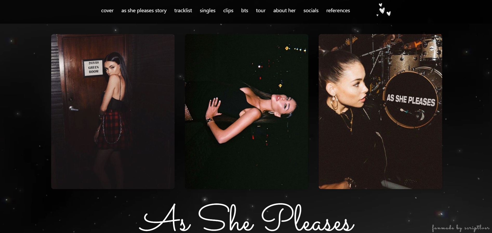
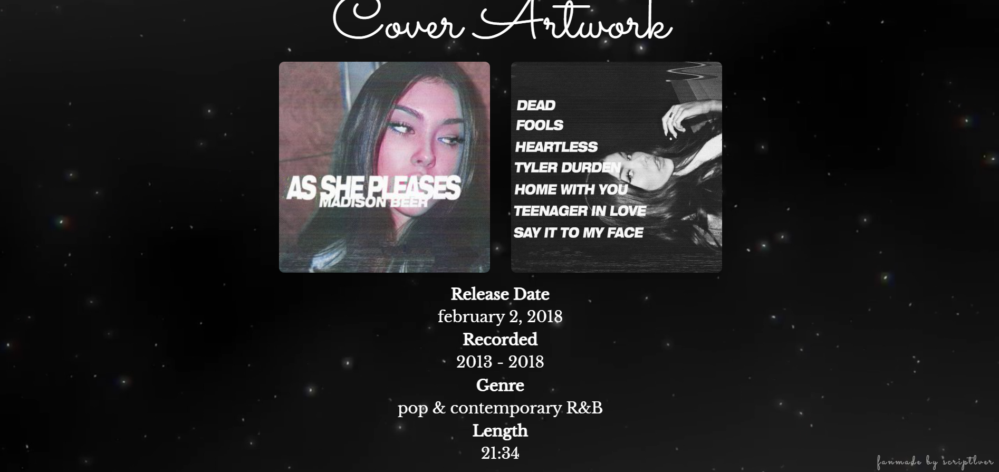
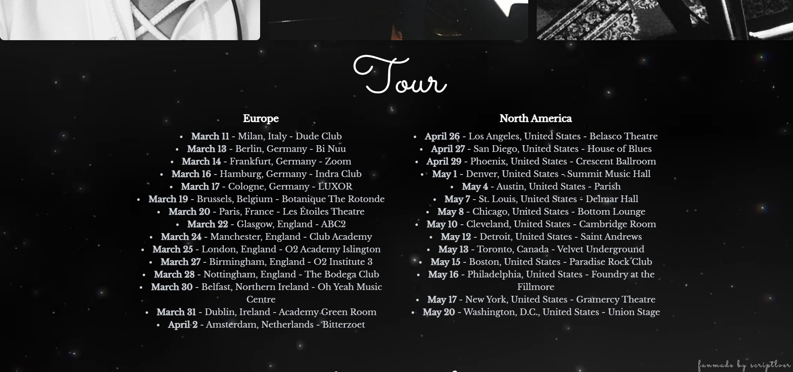

# as she pleases website 💗

hiii everyone! 💗

i present my first website, developed with **html and css**, with the help of **github copilot**! 💗 this project is completely dedicated to **madison beer's album _as she pleases_**, bringing an interactive experience to fans.

## 🎶 features

✨ **on the site, you'll find:**
- 💗 clips of the songs from the album
- 💗 all the tracks to listen to
- 💗 exclusive behind-the-scenes photos
- 💗 curiosities about the production of the album
- 💗 a design inspired by the aesthetics of _as she pleases_

## 🌟 about the project
this was a very special project for me, where i was able to explore and improve my **web development skills**. i hope you enjoy it as much as i enjoyed creating it! 💗

## 🚀 technologies used
- html
- css
- github copilot

## 📸 preview

## 📌 how to access
you can check out the project by visiting: https://scriptlver.github.io/as-she-pleases-fanmade-site/

## 💗 contributing
feel free to open issues or pull requests if you have any suggestions or improvements!

## 📜 license
this project is for educational and entertainment purposes only.
